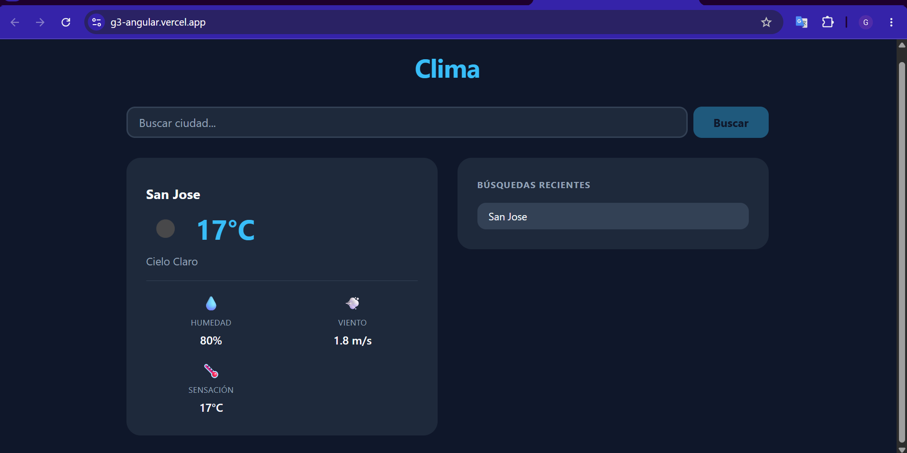
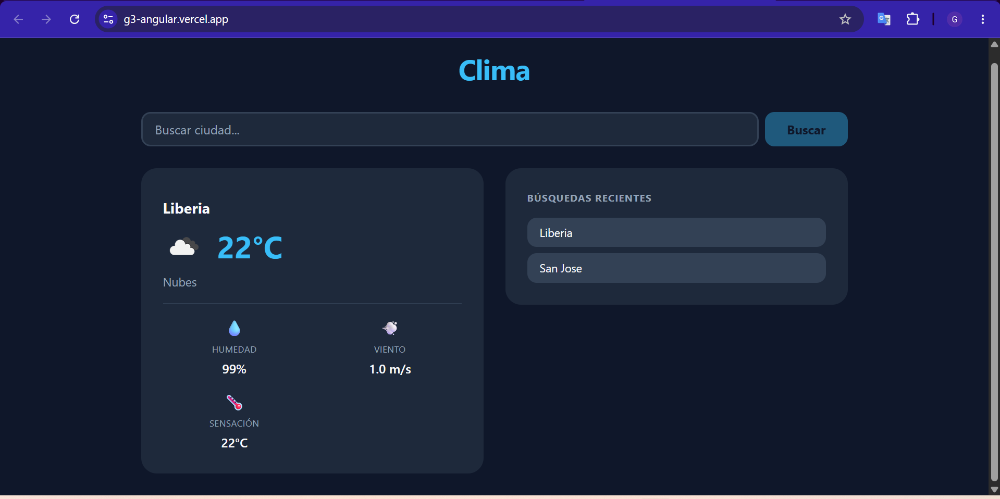
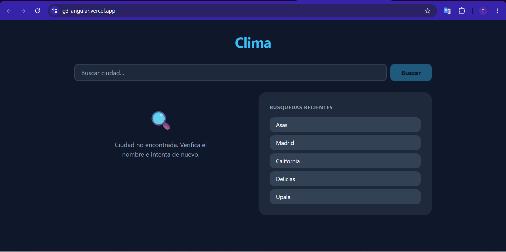
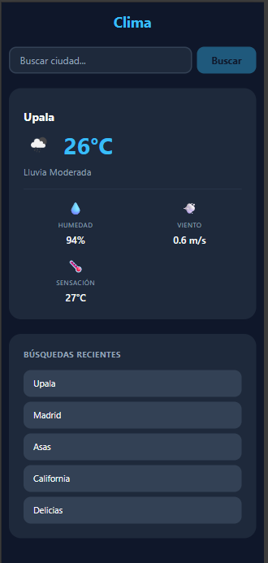

# G3 · App del Clima · Angular

> **Demo:** _[URL de Vercel — completar tras el deploy]_
> **Framework:** Angular 22 · Standalone + Signals + Zoneless + Resource API

Proyecto de investigación aplicada sobre Angular moderno (IF7102 Multimedios, UCR).
App del clima que consume la API de OpenWeatherMap y demuestra las características clave de Angular 22.

---

## Stack

| Tecnología | Uso |

Angular 22 | Framework principal |
`provideZonelessChangeDetection()` | Detección de cambios sin ZoneJS |
Signals + `computed` + `effect` | Estado reactivo fino-grano |
`httpResource` (Resource API) | Fetch del clima sin RxJS |
`@if` / `@for` / `@switch` | Control flow moderno |
CSS plano mobile-first | Sin librerías UI externas |
localStorage | Persistencia del historial |
OpenWeatherMap API | Fuente de datos del clima |

---

## Setup local

```bash
# 1. Clonar el repositorio
git clone https://github.com/[usuario]/g3-angular-clima.git
cd g3-angular-clima

# 2. Instalar dependencias
npm install

# 3. Configurar la API key (ver sección siguiente)
cp src/environments/environment.example.ts src/environments/environment.ts
# Editar environment.ts y reemplazar 'YOUR_API_KEY_HERE' con tu key real

# 4. Levantar el servidor de desarrollo
npm start
```

Abre `http://localhost:4200` para ver la app.

---

## Configuración de la API key

La API key de OpenWeatherMap **no se sube al repositorio** (gitignored). Hay dos formas de configurarla:

**Local:**
1. Copia el archivo template: `cp src/environments/environment.example.ts src/environments/environment.ts`
2. Abre `src/environments/environment.ts` y reemplaza `'YOUR_API_KEY_HERE'` con tu key real de [openweathermap.org](https://openweathermap.org)

**Deploy (Vercel/Netlify):**
1. En el dashboard, agrega la variable de entorno `OPENWEATHER_API_KEY` con tu key
2. El script `scripts/set-env.mjs` la inyecta automáticamente en cada build via `npm run prebuild`

> **Nota:** La key de OpenWeatherMap es pública en el bundle del navegador (limitación de frontend sin backend proxy). Lo que se protege es que no quede en el historial de Git del repositorio público.

---

## Decisiones de arquitectura

### Estado centralizado en un solo servicio

Todo el estado reactivo vive en `WeatherService` (`providedIn: 'root'`): la ciudad actual, el historial, el recurso HTTP y los estados derivados. El historial y el clima están acoplados (buscar agrega al historial), por lo que un solo servicio basta y evita indirección innecesaria.

### `httpResource` en lugar de RxJS

Se usa la Resource API de Angular 22 (`httpResource`) para el fetch del clima. La URL es reactiva: se deriva de la signal `city` y devuelve `undefined` cuando no hay ciudad, lo que mantiene el recurso en estado `idle` sin hacer requests innecesarios. Esto reemplaza el patrón `HttpClient + switchMap + toSignal` de Angular tradicional.

### `viewState` como fuente única de verdad

Un computed `viewState` con 8 estados (`idle`, `loading`, `not-found`, `network`, `error`, `ready`, `ready-updating`, `ready-stale`) es la única fuente de verdad para el template. Centraliza la lógica de clasificación de errores y estados de carga, eliminando condicionales dispersos en la vista.

### Zoneless + Signals

Al eliminar ZoneJS (`provideZonelessChangeDetection()`), la detección de cambios solo ocurre cuando una signal cambia. Esto hace que el rendimiento sea fino-grano y predecible. Todo el estado es reactivo por signals; no hay mutaciones fuera de ellas.

### 7 componentes presentacionales

Los componentes son "dumb" (no inyectan servicios). Reciben datos vía `input()` y emiten eventos vía `output()`. La lógica vive en `WeatherService`; los componentes solo renderizan. Esto facilita la lectura y la presentación oral del código.

---

## Conceptos clave del framework

**Signals y `computed`**
Los signals son primitivas reactivas de Angular que notifican cambios solo cuando su valor cambia. Los `computed` derivan estado de signals existentes sin efectos secundarios. En esta app, `viewState` y `currentWeather` son computeds que derivan del estado del recurso HTTP.

**Resource API (`httpResource`)**
`httpResource` crea un recurso HTTP reactivo: define una función que devuelve la URL, y Angular hace el fetch automáticamente cada vez que las signals referenciadas cambian. Cancela el request anterior si la URL cambia antes de que complete. Sus signals de estado (`status()`, `value()`, `error()`, `hasValue()`) alimentan directamente el template.

**Zoneless change detection**
Al reemplazar ZoneJS por `provideZonelessChangeDetection()`, Angular no parchea las APIs del navegador para detectar cambios. Solo re-renderiza cuando una signal usada en el template cambia. Esto mejora el rendimiento y elimina una dependencia de 50KB.

**Standalone components**
Cada componente declara sus propias dependencias en `imports: []`, sin necesidad de `NgModule`. Esto hace que el árbol de dependencias sea explícito y el código más fácil de razonar.

---

## Características implementadas

1. **Buscador de ciudad** — input con botón "Buscar" y soporte de tecla Enter
2. **Datos actuales** — temperatura, descripción, icono del clima, humedad, viento y sensación térmica
3. **Historial de búsquedas** — últimas 5 ciudades con move-to-front, sin duplicados
4. **Estado de carga** — spinner animado con `prefers-reduced-motion`
5. **Manejo de errores** — ciudad no encontrada (404), sin conexión (red), error genérico
6. **Persistencia** — historial guardado en localStorage, sobrevive recargas de página

---

## Pros y contras de Angular en esta app

### Pros
- **Signals simplificaron el estado**: `viewState` como computed elimina lógica compleja en el template
- **`httpResource` es declarativo**: la URL reactiva + cancelación automática evitan bugs de condiciones de carrera
- **Zoneless es predecible**: el rendimiento es fino-grano sin configuración extra
- **Standalone reduce fricción**: sin NgModules, cada componente declara sus dependencias explícitamente

### Contras
- **Curva de aprendizaje de Signals**: el modelo mental de reactividad fino-grano es diferente al de ZoneJS + observables
- **Resource API con poca documentación de la comunidad**: menos ejemplos que `HttpClient` tradicional
- **CSS manual toma más tiempo**: sin librería UI, cada componente requiere estilos propios desde cero

---

## Capturas

> Tomar capturas de la app en ejecución y guardarlas en `docs/capturas/`

| # | Estado | Archivo |
|---|---|---|
| 1 | Ciudad por defecto al cargar |  |
| 2 | Búsqueda exitosa |   |
| 3 | Ciudad inexistente (404) | |
| 4 | Vista móvil |   |

---

## Estructura del proyecto

```
src/app/
├── app.ts                          # Container: wiring de service → componentes
├── app.html                        # Template: @switch + @if + layout
├── app.css                         # Layout responsive (mobile-first, 1 breakpoint)
├── services/
│   └── weather.service.ts          # Estado global: signals + httpResource + effects
└── components/
    ├── search-bar/                 # Input + botón, emite (search)
    ├── weather-card/               # Titular: temp + icono + descripción + 3 detalles
    ├── weather-detail/             # Primitiva reutilizable: icono + label + valor
    ├── history-list/               # Lista del historial, emite (select)
    ├── history-item/               # Botón de ciudad individual
    ├── state-message/              # Estados sin data: loading/error/idle
    └── loading-spinner/            # Spinner CSS puro con prefers-reduced-motion
```

---

## Scripts disponibles

```bash
npm start          # Servidor de desarrollo (http://localhost:4200)
npm run build      # Build de producción (incluye prebuild con set-env.mjs)
```
## Link de la demo
- https://g3-angular.vercel.app/
